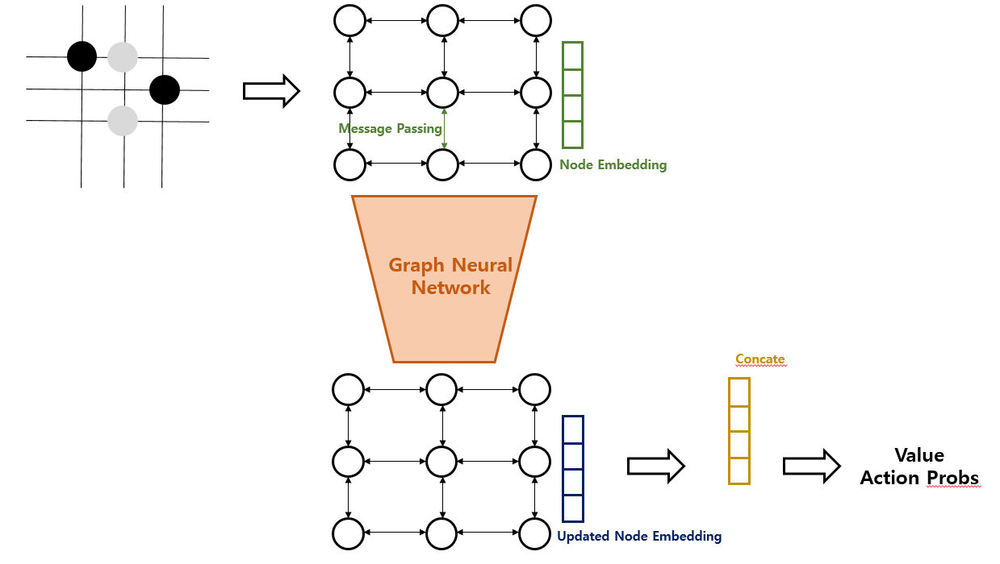

## GNN Procedure Explanation

---

## CNN vs GNN

|                               | CNN            | GNN            |
| ----------------------------- | -------------- | -------------- |
| # of Parameters               | 105,317        | 30,277         |
| Training Time(100 epochs)     | 1h 11m 38s     | 1h 14m 01s     |
| Battle Results                | 0 Win 100 Lose | 100 Win 0 Lose |

## Dimension 계산 방법

1. Conv(num_channels, kernel_size, stride, padding)
    - input: (W_in, H_in, C_in)
    - output: ((W_in - kernel_size + 1 + padding * 2) // stride, (H_in - kernel_size + 1 + padding * 2) // stride, num_channels)
2. BatchNorm
    - input: (W_in, H_in, C_in)
    - output: (W_in, H_in, C_in)
3. SGConv(num_channels) 및 다른 GNN Layer(GCNConv, GATConv, SAGEConv, GINConv)
    - input: (number of nodes, C_in)
    - output: (number of nodes, num_channels)
